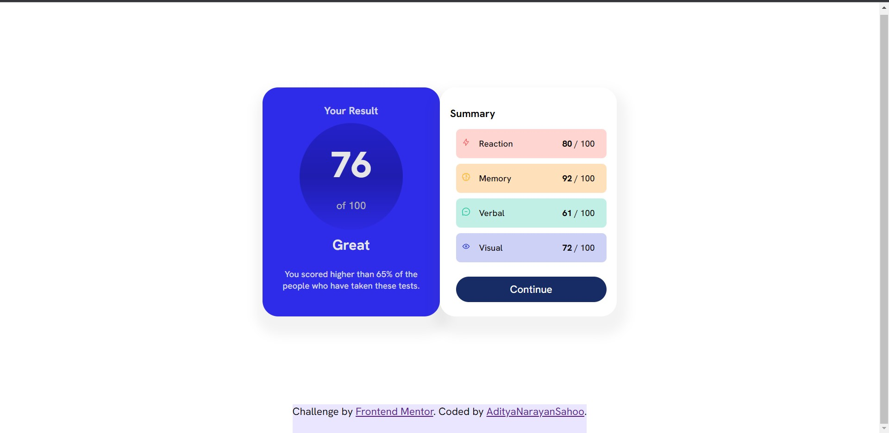

# Result-Summary-Component
This is a solution to the Result Summary component challenge on Frontend Mentor.

# Frontend Mentor - Results summary component solution

This is a solution to the [Results summary component challenge on Frontend Mentor](https://www.frontendmentor.io/challenges/results-summary-component-CE_K6s0maV). Frontend Mentor challenges help you improve your coding skills by building realistic projects. 

## Table of contents

- [Overview](#overview)
  - [Screenshot](#screenshot)
  - [Links](#links)
- [My process](#my-process)
  - [Built with](#built-with)
  - [Continued development](#continued-development)
  - [Useful resources](#useful-resources)
- [Author](#author)
- [Acknowledgments](#acknowledgments)

## Overview

### Screenshot

### Links

- Solution URL: [https://github.com/aditya-narayan-sahoo/Result-Summary-Component](https://github.com/aditya-narayan-sahoo/Result-Summary-Component)
- Live Site URL: [https://aditya-narayan-sahoo.github.io/Result-Summary-Component/](https://aditya-narayan-sahoo.github.io/Result-Summary-Component/)

## My process

### Built with

- Semantic HTML5 markup
- CSS custom properties
- Flexbox

### Continued development

This is just the desktop version, i will continue development for the mobile version too.

### Useful resources

- [MDN Web Docs](https://developer.mozilla.org/en-US/docs/Learn/CSS/CSS_layout/Flexbox) - This helped me to understand flexbox properties. I really liked this pattern and will use it going forward

## Author

- Website - [Aditya Narayan Sahoo](https://github.com/aditya-narayan-sahoo)
- Frontend Mentor - [@aditya-narayan-sahoo](https://www.frontendmentor.io/profile/aditya-narayan-sahoo)

## Acknowledgments

The MDN Web Docs has become the one site solutions for all my problems. You can too try it out at [MDN Web Docs](https://developer.mozilla.org/en-US/)

